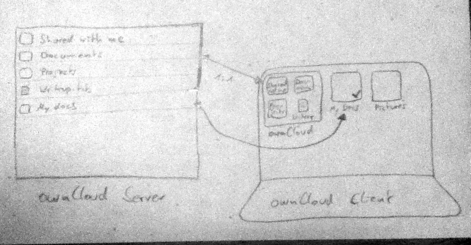
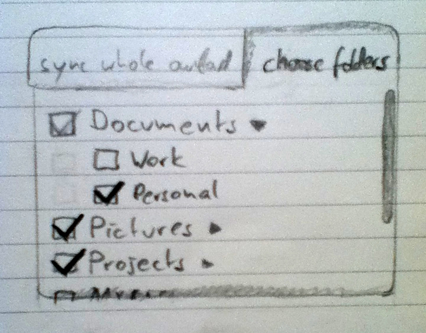
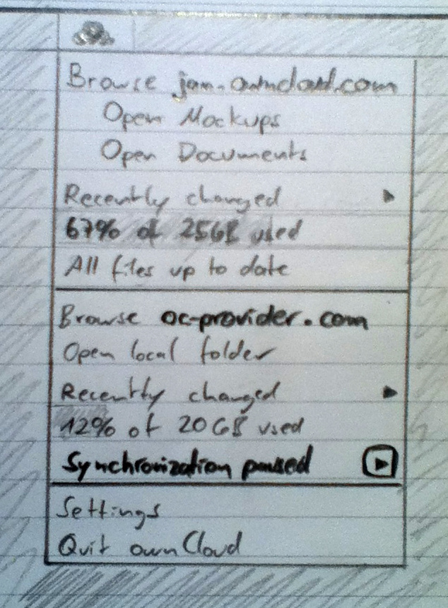

# ownCloud desktop client

## General thoughts

* We need to optimize for the standard use case: just syncing everything inside the user account on the ownCloud server with an »ownCloud« folder in the user’s home folder on the device.
  * »clientsync« subfolder needs to be phased out
  * »sync target« choice also needs to be removed because it’s too unspecific to ownCloud – of course I want to sync with my ownCloud when I installed the client ;)
* It should be possible to do selective sync, that is only syncing down specific folders from the server, useful for small machines or bad connections. Not granular down to the file level though to keep it simple.
* It should also be possible to sync folders from anywhere on your computer. Either by just right-clicking on the folder and choosing »Sync with ownCloud« or by adding it manually in the settings.
* Small files should be synced first because that’s fast and most likely text with lots of useful content.
* »mirall« repo name should be changed to »desktop« to clear up confusion when wanting to report issues, contribute, etc.
* Lots of these points are also valid for the iOS and Android clients

## Sync mechanism
First off we need to define how syncing works, with selective sync and different clients.

The default setup (advanced options ignored) will sync all files and folders of the ownCloud Files app into an »ownCloud« folder in your home directory. For a regular setup, the contents of the local »ownCloud« folder will be the same as what you see when you look into the Files app of the web interface. (For the advanced options see below and under Setup.)

(The quality on the 2 following diagrams is bad, but suffices to get the point across.)
Now when you want to selectively sync any folder from your desktop, it should show in the root of the Files app in the web interface, with the same name it locally has on the device it comes from. Ideally the client should know that this device already has the folder somewhere and _not_ duplicate it by syncing it down to the ownCloud folder.

When you then connect a second device and choose the default setup with syncing everything, that device will receive all contents of the ownCloud Files root in the local »ownCloud« folder. Including the selectively synced folders and files from other devices.

For existing users of the client simply do not migrate anything. If you just update as existing user, everything works as before with the clientsync folder. We have to inform people that if they want to switch to the new »easy way« they will have to uninstall and reinstall.

## Setup

## Indicator menu

* Browse ownCloud server
  * Can have multiple servers, but will only show 2 completely in the indicator because otherwise it gets too long. Any additional ones should just have one line each, having a menu expand to the side.
* Open local folder
  * If selective sync on the desktop is used, this can also have multiple entries. Clicking any of those should open the relevant folder in the file manager.
* Recently changed
  * A list of, say, 5 recently changed files from the server.
  * Last entry of the list could be a link to a future »status updates« page.
* X% of XGB used
  * If possible, this could have a bar indicator as a background.
  * For branded clients there could be a »get more« link on the right of this to a pricing page of the provider.
* Sync state, each one with a button to the right
  * All files up to date (force sync button, circular arrows icon)
  * Syncing X files (x:xx remaining) (pause sync, pause icon)
  * Synchronization paused (resume sync, play icon) set in bold
  * Offline (reconnect button, circular arrows icon) set in bold
  * Connection error (reconnect button, circular arrows icon)
    * If a retry doesn’t work, replace the reconnect button with a link to the account in settings
* Settings
* Quit ownCloud

## Discovery & Installation
Improving the client also includes improving how people discover, download and install it. Thoughts on the different ways people might do this:

 * Visit owncloud.org/com, look for client
   * Should probably show directly on frontpage, ideally detect your operating system and focus on the relevant download.
 * googling for owncloud dektop/client/windows/mac/linux, leads to owncloud.org/sync-clients or owncloud.com/download
   * both of these pages should detect the client they are accessed from and prioritize the download links accordingly
 * Is the current version installable from the Mac Appstore or Ubuntu Software Center? Is it feasible to keep it updated in there?
 * Is it possible to automatically open the app (connect dialog) after installation?

