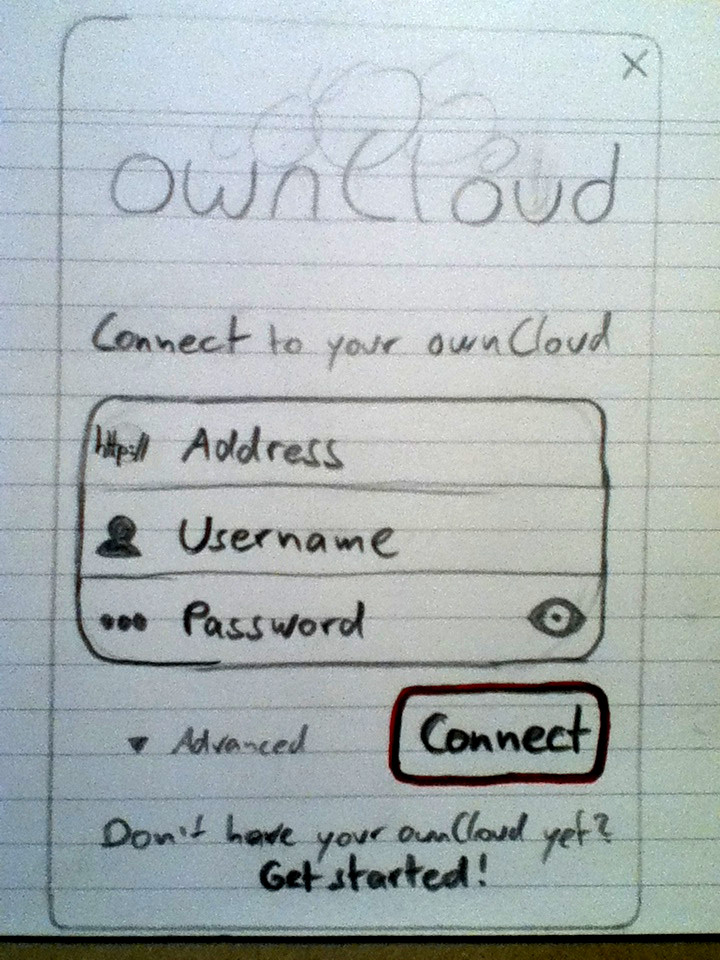
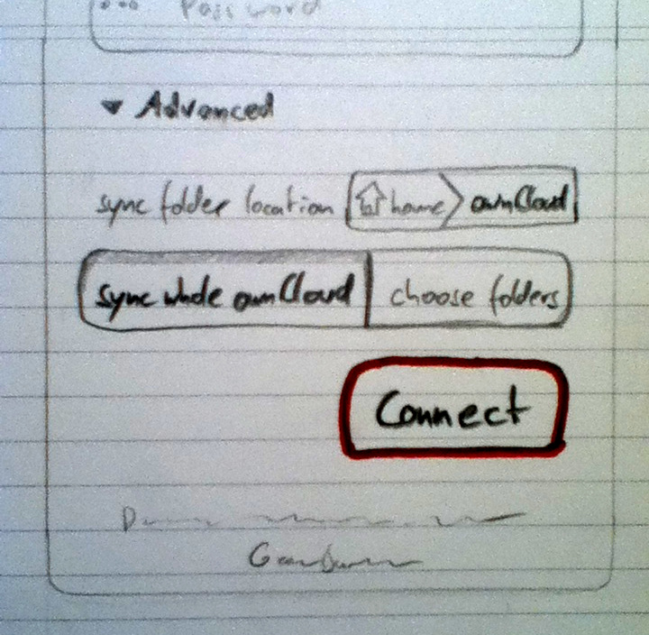

# ownCloud desktop client

## Sync mechanism
First off we need to define how syncing works, with selective sync and different clients.

The default setup (advanced options ignored) will sync all files and folders of the ownCloud Files app into an »ownCloud« folder in your home directory. For a regular setup, the contents of the local »ownCloud« folder will be the same as what you see when you look into the Files app of the web interface. (For the advanced options see below and under Setup.)

(The quality on the 2 following diagrams is bad, but suffices to get the point across.)
Now when you want to selectively sync any folder from your desktop, it should show in the root of the Files app in the web interface, with the same name it locally has on the device it comes from. Ideally the client should know that this device already has the folder somewhere and _not_ duplicate it by syncing it down to the ownCloud folder.

When you then connect a second device and choose the default setup with syncing everything, that device will receive all contents of the ownCloud Files root in the local »ownCloud« folder. Including the selectively synced folders and files from other devices.

For existing users of the client simply do not migrate anything. If you just update as existing user, everything works as before with the clientsync folder. We have to inform people that if they want to switch to the new »easy way« they will have to uninstall and reinstall.

## Setup

## Indicator

